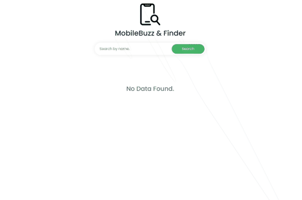

# MobileBuzz Mobile finder application 

This is simple mobile buzz application for find your desire mobile phone. here you will search mobile with specification of each mobile phone as well If this project helpful for making your idea please follow my account and get kind of unique project thanks.

# Using Technologies
```
- HTML5/HTML
- CSS3/CSS 
- Bootstrap Framework
- Vanilla JavaScript
- Google Fonts (Poppins)
- Phone API from Programing Hero
- VS Code Editor
- Github / Git bash
- Windows Terminal
- Favicon from icons8
- Logo from Google 
```

# Required Features
- Searching system by name 
- Load more system
- When someone click each phone more info button  they can see details particular phone details
- Fancy Preloader & Error Message


# Get a live link

# Demo Preview this project.


>Thanks for reach out me on github.